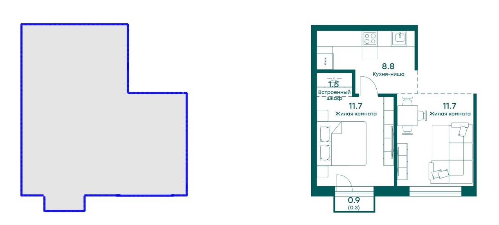

# SVG assignment
## Задача
Необходимо сделать векторное изображение-маску из исходного SVG изображения. В папке public есть три файла:
* 1.svg
* 2.svg
* 3.svg

### Требования
* Маска должна находиться в той же позиции, что и исходное изображение. Размеры изображений также должны быть одинаковыми.
* Ваш алгоритм должен успешно отрабатывать на всех трех файлах.
* Данную маску можно заполнить любым цветом и сделать обводку.
* В исходное изображение не должно быть внесено изменений.

Пример находится в файле `src/pages/index.tsx`
Для запуска проекта необходимо выполнить комманду `npm run dev` и открыть в браузере [http://localhost:3000](http://localhost:3000)

Для запуска потребуется `Node.js` версии 20 или выше.

Пример решённого задания
